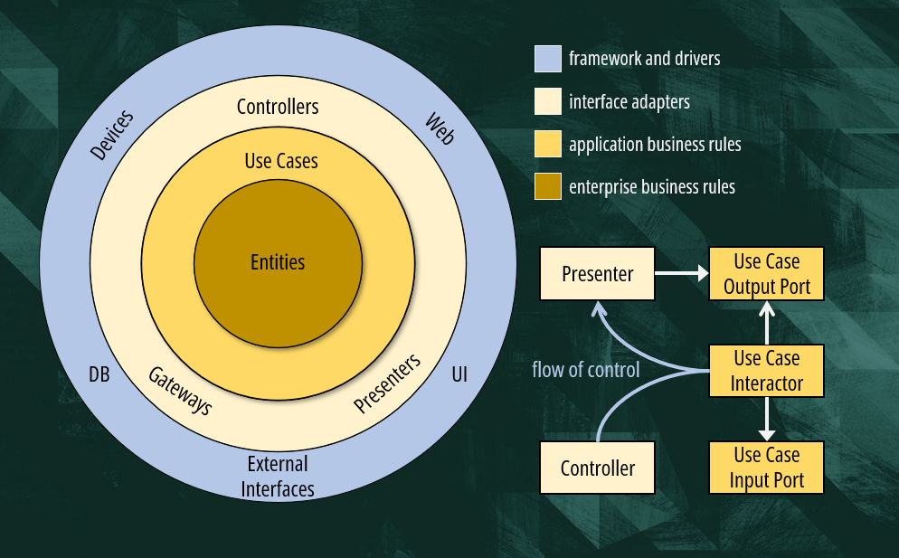

--- 
## Exercicio Projeto Escolar
Criado só para praticar desenvolvimento web

## Explorando a Clean Architecture

-   **Domain Entities (Regras de Negócio Corporativas):** O núcleo da aplicação, contendo as regras de negócio mais gerais e de alto nível. São independentes de qualquer camada externa.
-   **Domain Use Cases (Regras de Negócio da Aplicação):** Orquestram o fluxo de dados para e das Entities. Contêm as regras de negócio específicas da aplicação, mas ainda são independentes de UI, banco de dados, etc.
-   **Application Interface Adapters (Adaptadores de Interface):** Convertem dados dos Use Cases e Entities para formatos mais convenientes para frameworks e bancos de dados, e vice-versa. Inclui Controllers, Presenters e Gateways.
-   **infrastructure Frameworks & Drivers (Dispositivos, Web, UI, Interfaces Externas, DB):** A camada mais externa, composta por frameworks, bancos de dados, dispositivos e UI. São os detalhes que podem ser facilmente trocados.

